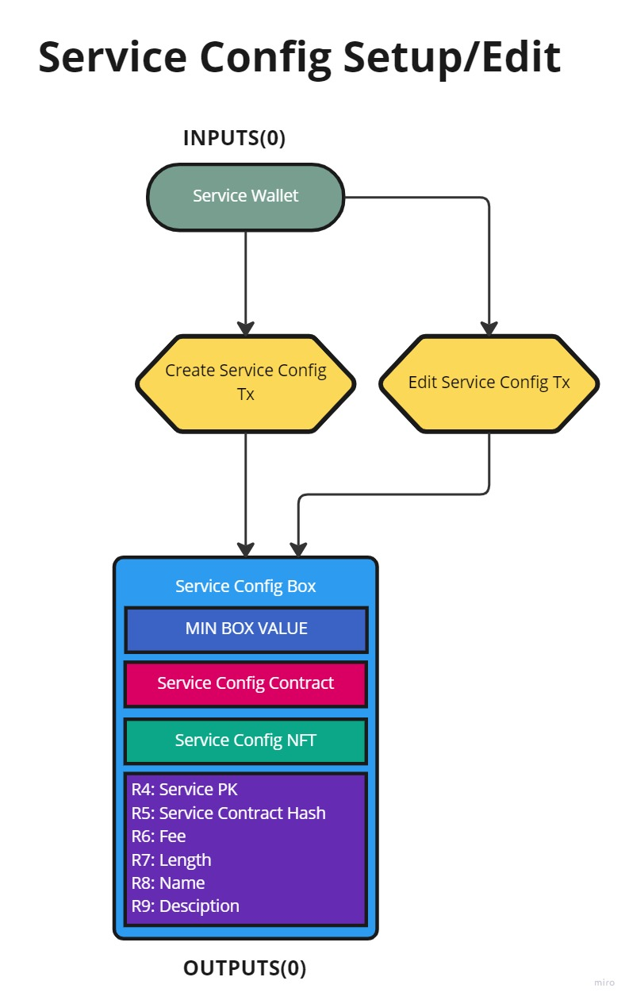
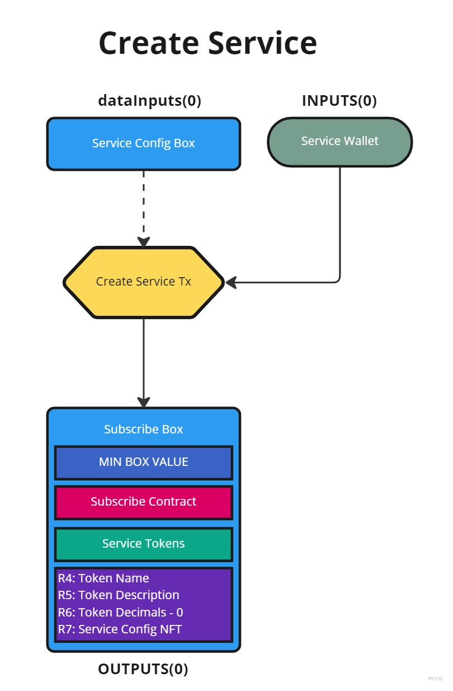
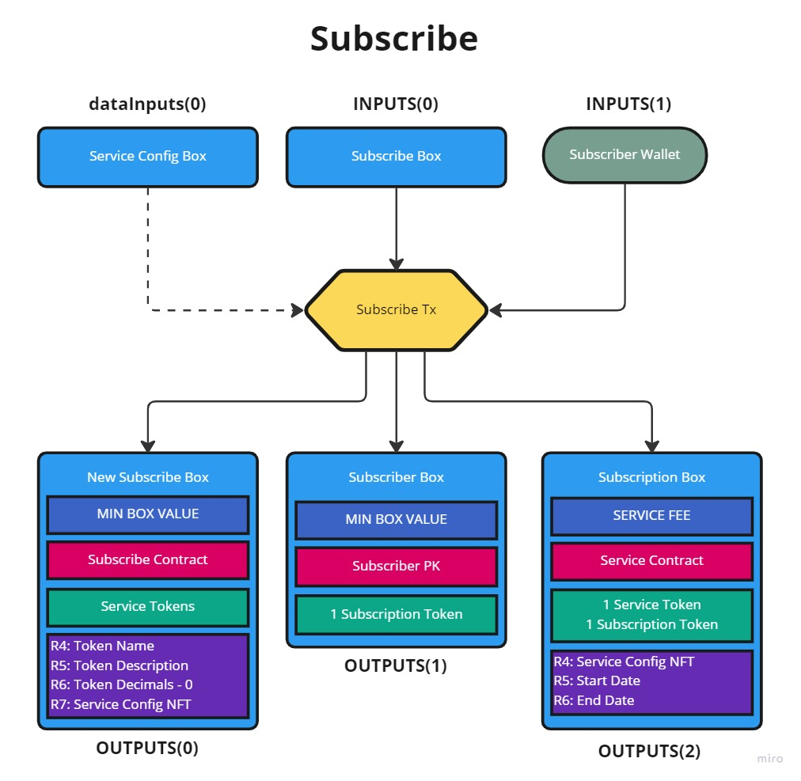
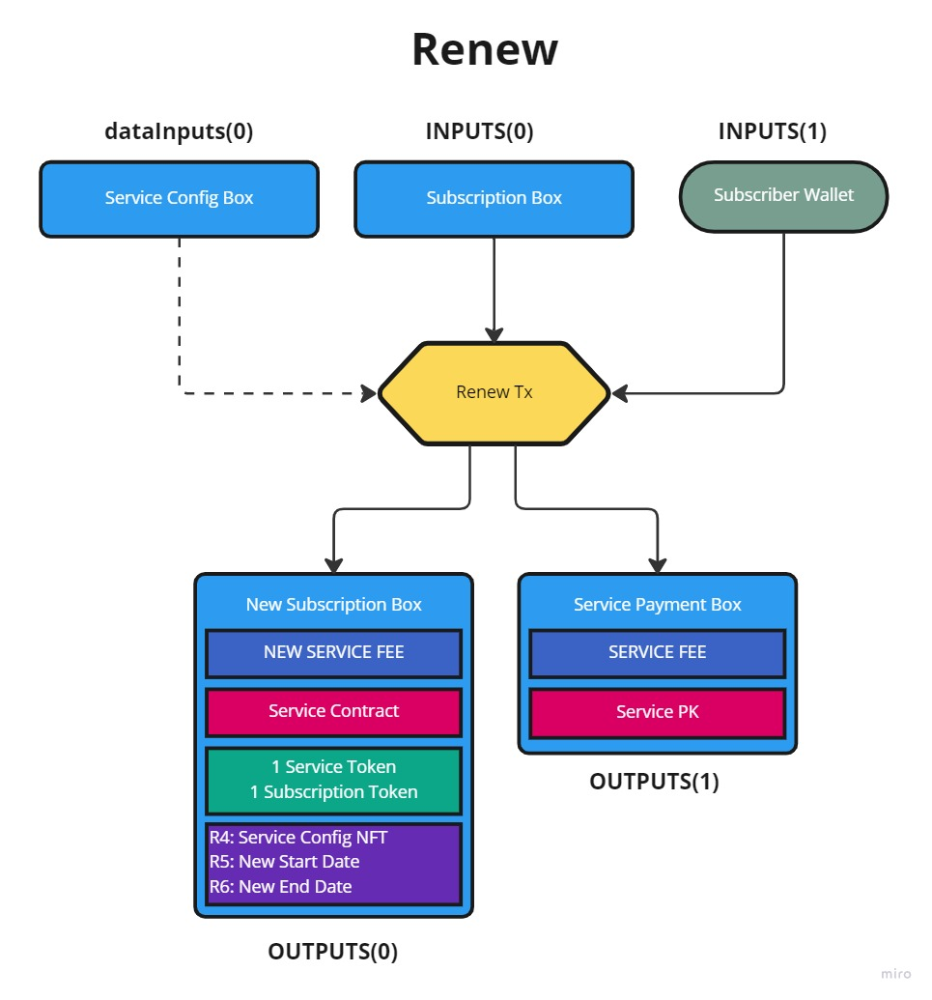
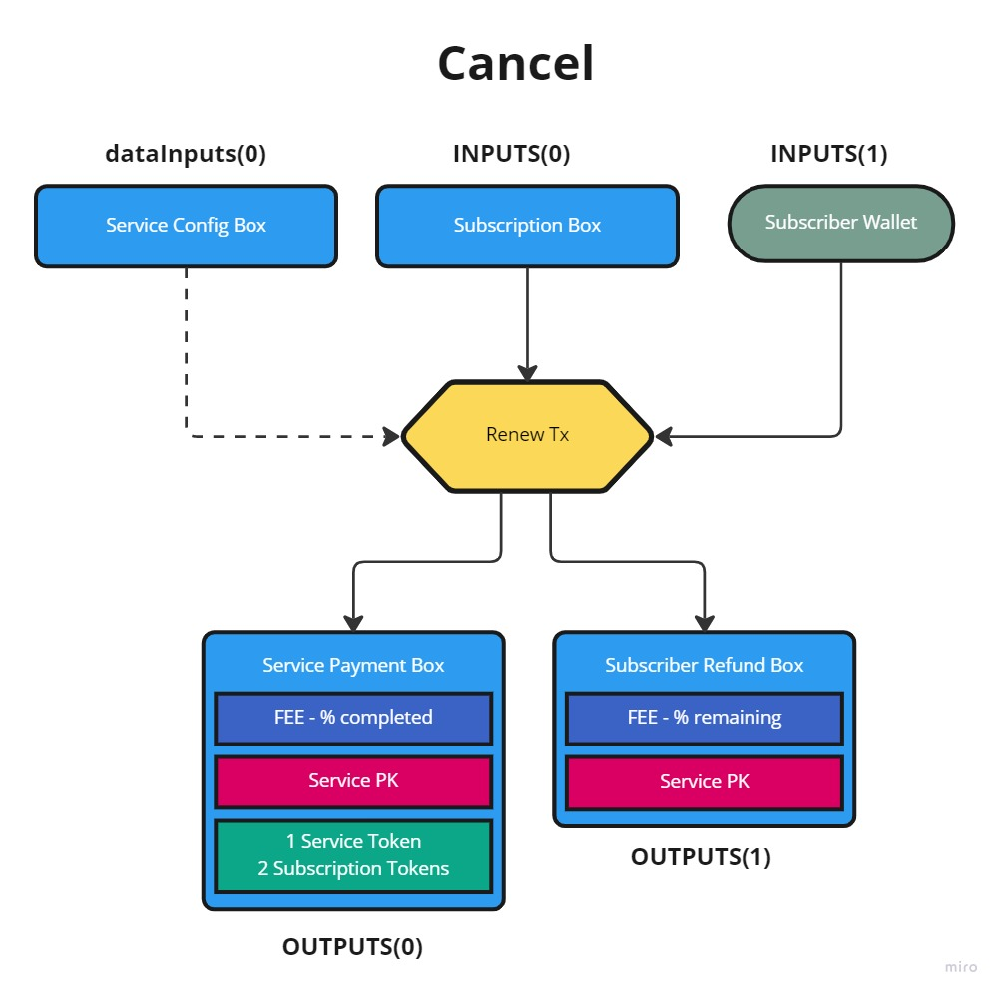
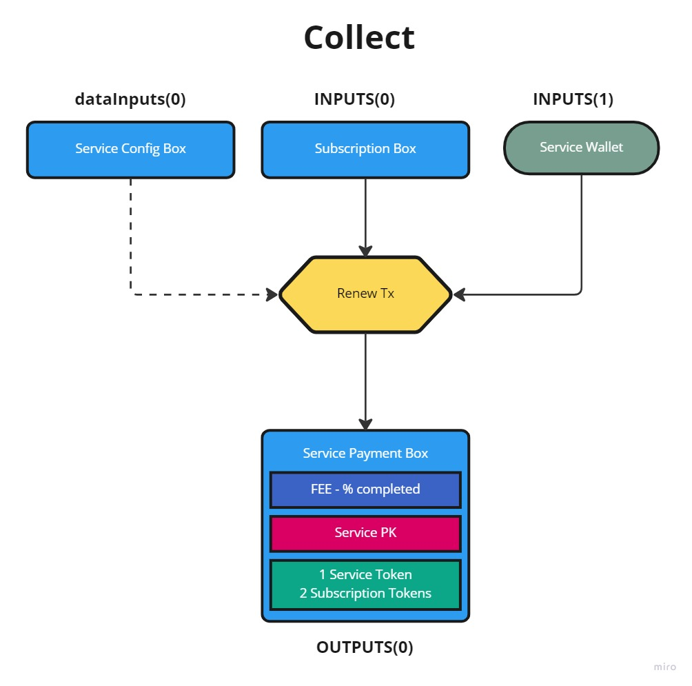
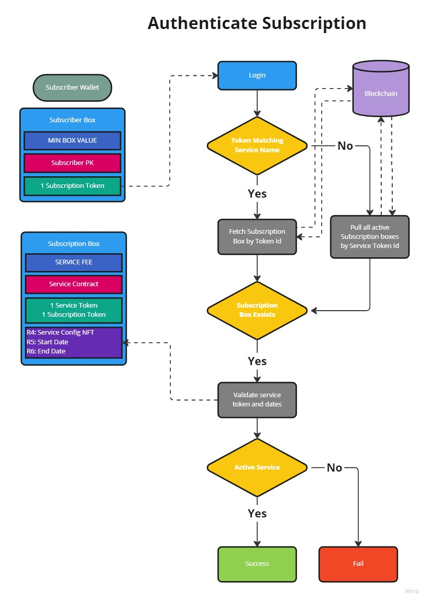

# Sigma Subscriptions

Toolset for managing subscriptions on Ergo built with [Fleet SDK][fleet]

### Installation
  ```sh
  npm install sigma-subscriptions
  ```

# Usage

### Setup
  ```sh
    import { SigmaSubscriptions } from 'sigma-subscriptions';
    let manager = new SigmaSubscriptions(Network.Mainnet);
  ```  
Set desired API url
  ```sh
    let manager = new SigmaSubscriptions(Network.Mainnet, "https://api.ergoplatform.com/api/v1/");
  ```

### Create Service Configuration
  ```sh
    const tx = await manager.createServiceConfig(ergo, name, description, fee, length);
  ```

### Edit Exisiting Service Configuration
  ```sh
    const serviceConfigNFT = "a03c1503ab91a256ee9d256bd8cb3866c2803c2cca1450c33ced5f142d7b4cd7";
    const tx = await manager.editServiceConfig(ergo, serviceConfigNFT, name, description, fee, length);
  ```

### Create Service
  ```sh
    const tx = await manager.createService(ergo, serviceConfigNFT);
  ```
Set max number of subscriptions
  ```sh
    const tx = await manager.createService(ergo, serviceConfigNFT, "100");
  ```

### Subscribe
  ```sh
    const serviceTokenId = "0c5b3144f8db88ce0fd78c0a7fd5f5681f4bc26382c6c4c0a964d99c14fb78c3";
    const tx = await manager.subscribe(ergo, serviceTokenId);
  ```

#### Renew
  ```sh
    const tx = await manager.renew(ergo, serviceTokenId);
  ```
  
#### Cancel
  ```sh
    const tx = await manager.cancel(ergo, serviceTokenId);
  ```
  
### Collect
  ```sh
    const subscriberBoxId = "2128567ba692bac62bce7c0d631e09862dbbb78e6cf5ee02154ecdf12e7b521e";
    const tx = await manager.collect(ergo, subscriberBoxId);
  ```
  
### Authenticate Subscription
  ```sh
    const serviceTokenId = "0c5b3144f8db88ce0fd78c0a7fd5f5681f4bc26382c6c4c0a964d99c14fb78c3";
    const auth: SigmaSubscriptionsAuthResponse = await manager.auth(ergo, serviceTokenId);
  ```
  
#### Get Services
  ```sh
    const services = await manager.getServices(serviceWalletAddress);
  ```
  
#### Get Subscriptions
  ```sh
    const subscriptions = await manager.getSubscriptions(serviceTokenId);
  ```
 
<p align="right">(<a href="#top">Back to top</a>)</p>

## ErgoScript Contracts [View All](/contracts)

#### Service Configuration Contract [View](/contracts/ServiceConfigContract.ergo)
This contract is used to manage the settings for a given subscription service. 

#### Subscribe Contract [View](/contracts/SubscribeContract.ergo)
This contract is used to manage the distrubtion of subscription tokens, ensure the fee is sent to the correct subscription contract, and ensure the a correct subscription length is set.

#### Service Contract [View](/contracts/ServiceContact.ergo)
This contract holds the service fee. Its created on a subscribe and is used to enforce the renewal, cancel, and collect rules. 

<p align="right">(<a href="#top">Back to top</a>)</p>

## Details

### Configuration
Config boxes are created to manage subscription services and are used as data inputs to ensure proper setup of subscriptions. They should contain the following.
<ul>
  <li>Service Config NFT</li>
  <li>R4: Service Address</li>
  <li>R5: Hash of Service Contract</li>
  <li>R6: Service Fee</li>
  <li>R7: Service Length (milliseconds)</li>
  <li>R8: Service Name</li>
  <li>R9: Service Description</li>
</ul>



<hr>

### Create Service
Services are created with a configuation box and they will control the distribution of Service Tokens. They will contain the following.
<ul>
  <li>Service Tokens</li>
  <li>R4: Service Name</li>
  <li>R5: Service Description</li>
  <li>R6: 0 (Decimals in EIP-004 token standard)</li>
  <li>R7: Service Config NFT</li>
</ul>



<hr>

### Subscribe 
Subscription boxes are created when the Subscribe box is spent. This will result in 2 Subscription tokens being minted with 1 sent to the Subscribe box and other sent to the Subsciber wallet. The Subscription box will contain the following.
<ul>
  <li>1 Service Token from the Subscribe box</li>
  <li>1 Subscription Token that is minted</li>
  <li>R4: Service Config NFT</li>
  <li>R5: Start date of service (unix timetamp in milliseconds)</li>
  <li>R6: End date of service (unix timetamp in milliseconds)</li>
</ul>



<hr>

### Renew
To renew a service contract the subscriber must send the correct fee along with their unique Subscription Token.
The service box is then recreated, the previous fee is sent to the Service address, and the Start/End dates are adjusted.



<hr>

### Cancel 
To cancel a subscription the subscriber must send thier unique Subscription Token
<ul>
  <li>If the service start date has not been reached then a full refund is issued</li>
  <li>If the service is active then a partal refund is issued and the remaning fee is sent to the service</li>
  <li>THe Service Token and both Subscription Tokens are sent back to the service</li>
</ul>



<hr>

### Collect 
The service can force collect the fee in this box if the service end date has passed.



### Authentication
A subscription is considered valid if there is a unspent Subscription Box containing the service token and a unique subscription token. 



<p align="right">(<a href="#top">Back to top</a>)</p>

## License

Distributed under the MIT License. See `LICENSE` file for more information.

<p align="right">(<a href="#top">Back to top</a>)</p>

## Contact
Discord: @cornbelt [#sigma-subscriptions][discord]

Open source is the way.

<p align="right">(<a href="#top">Back to top</a>)</p>

[fleet]: https://fleet-sdk.github.io/docs/
[discord]: https://discord.gg/ergo-platform-668903786361651200
